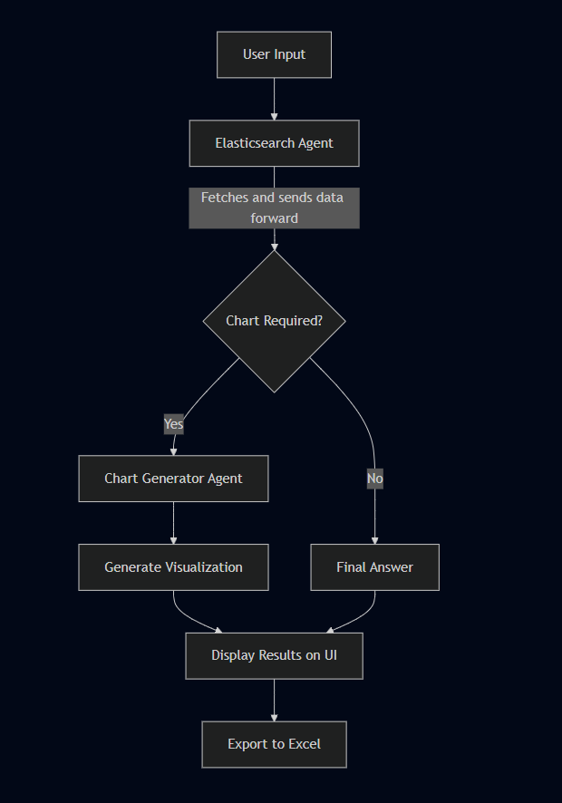

# Elasticsearch Query Agent

A sophisticated multi-agent system that provides natural language querying capabilities for Elasticsearch databases with dynamic chart generation and data visualization. This project combines the power of LangGraph, Streamlit, and FastAPI to create an intelligent interface for complex data analysis tasks.

##  Features

### Multi-Agent Architecture
- **Elasticsearch Agent**: Handles natural language to Elasticsearch query translation and fetches data from the database.
- **Chart Generator Agent**: Creates dynamic visualizations using Plotly

### Advanced Query Capabilities
- **Dynamic Filtering**: Support for complex boolean logic 
- **Geospatial Queries**: Location-based filtering with distance calculations
- **Date Range Queries**: Time-based filtering with flexible intervals
- **Aggregation Support**: Comprehensive aggregation types including:
  - Bucket aggregations (terms, date_histogram, histogram, range, filters, composite)
  - Metric aggregations (avg, sum, min, max, cardinality, value_count, stats, extended_stats)
  - Pipeline aggregations (bucket_selector, bucket_sort, avg_bucket, sum_bucket, min_bucket, max_bucket, stats_bucket, extended_stats_bucket)

### Data Visualization
- **Interactive Charts**: Plotly-based visualizations with multiple chart types
- **Dynamic Chart Generation**: Automatic chart type selection based on data and query context
- **Export Capabilities**: Excel export with formatted data and charts

### User Interface
- **Streamlit Web App**: Clean, intuitive chat interface
- **Real-time Processing**: Live query execution with progress indicators
- **Download Functionality**: Excel export with structured data sheets
- **Chat History**: Persistent conversation history with context

## Architecture

### Core Components

#### 1. **FastAPI Backend** (`main.py`)
- RESTful API for Elasticsearch queries
- Pydantic models for request/response validation
- Async Elasticsearch client integration
- Comprehensive error handling and logging

#### 2. **LangGraph Agent System** (`agent.py`)
- Multi-agent workflow orchestration
- Natural language processing with LLM integration
- Tool-based execution framework
- State management and checkpointing

#### 3. **Streamlit Frontend** (`app_streamlit.py`)
- Interactive web interface
- Real-time chat functionality
- Data visualization and export capabilities
- Session state management

### Agent Workflow



## Installation

### Prerequisites
- Python
- Elasticsearch instance
- LLM API access (OpenAI, Hugging Face, or Ollama)

### Environment Setup

1. **Clone the repository**
   ```bash
   git clone <repository-url>
   cd elasticsearch-query-agent
   ```

2. **Create virtual environment**
   ```bash
   python -m venv venv
   source venv/bin/activate  # On Windows: venv\Scripts\activate
   ```

3. **Install dependencies**
   ```bash
   pip install -r requirements.txt
   ```

4. **Environment Configuration**
   Create a `.env` file with the following variables:
   ```env
   # Elasticsearch Configuration
   ELASTICSEARCH_HOST=your_elasticsearch_host:port
   ELASTIC_USERNAME=your_username
   PASSWORD=your_password
   INDEX_PATTERN=your_index_pattern
   ALLOWED_FIELDS= {field1,field2,field3}
   
   # LLM Configuration
   OPENAI_API_KEY=your_openai_api_key
   HF_API_KEY=your_huggingface_api_key
   
   # API Configuration
   TOOL_API_URL=http://endpoint_host:port/
   ```

## Usage

### Starting the Services

1. **Start the FastAPI Backend**
   ```bash
   uvicorn main:app --host 0.0.0.0 --port 8000 --reload
   ```

2. **Start the Streamlit Frontend**
   ```bash
   streamlit run app_streamlit.py
   ```

## Data Export

The system automatically generates Excel files with:
- **Query Sheet**: Original question and AI response
- **Data Sheet**: Structured data with documents and aggregations
- **Formatted Output**: Professional formatting with headers and styling

## API Endpoints

### POST `/query`
Main query endpoint for Elasticsearch operations.

**Request Body:**
```json
{
  "filters": [
    {
      "field": "timestamp",
      "operator": "range",
      "value": {
        "gte": "2024-01-01",
        "lte": "2024-01-31"
      }
    }
  ],
  "logical_operator": "AND",
  "size": 1000,
  "scroll": "2m",
  "indices": "your_index_pattern",
  "aggregations": [
    {
      "name": "agg_ame",
      "type": "terms",
      "field": "field_name",
      "size": 10
    }
  ],
  "fields": ["timestamp", "field1", "field2"]
}
```

**Response:**
```json
{
  "total": 1500,
  "documents": [...],
  "aggregations": {...}
}
```

## Development

### Project Structure
```
elasticsearch_agent/
├── main.py              # FastAPI backend
├── agent.py             # LangGraph agent system
├── app_streamlit.py     # Streamlit frontend
├── requirements.txt     # Dependencies
├── .env                 # Environment variables
└── README.md           # This file
```
---

## Troubleshooting

### Common Issues

1. **Elasticsearch Connection**
   - Verify ELASTICSEARCH_HOST is correct
   - Check authentication credentials
   - Ensure index pattern exists

2. **LLM API Issues**
   - Verify API keys are valid
   - Check rate limits
   - Ensure model availability

3. **Chart Generation Errors**
   - Verify data structure compatibility
   - Check Plotly installation
   - Review chart code generation

## Contributing

1. Fork the repository
2. Create a feature branch
3. Make your changes
4. Add tests for new functionality
5. Submit a pull request

## License

This project is licensed under the MIT License - see the LICENSE file for details.

---

**Built with ❤️ using modern AI and data technologies** 